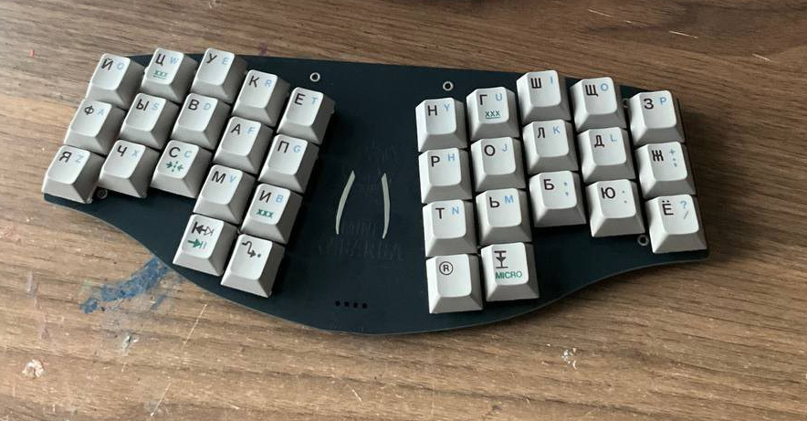

# ZMK firmware for Kabarga mini
This branch is intended for mini version the of the keyboard. For regular version use [another branch](https://github.com/aroum/zmk-kabarga/tree/kabarga). The bootloader and compiled firmware can be downloaded in the [releases section](https://github.com/aroum/zmk-kabarga/releases). You can change keymap using [this tool](https://nickcoutsos.github.io/keymap-editor/).

Now you can use [ZMK Studio](https://zmk.dev/docs/features/studio).

-----

